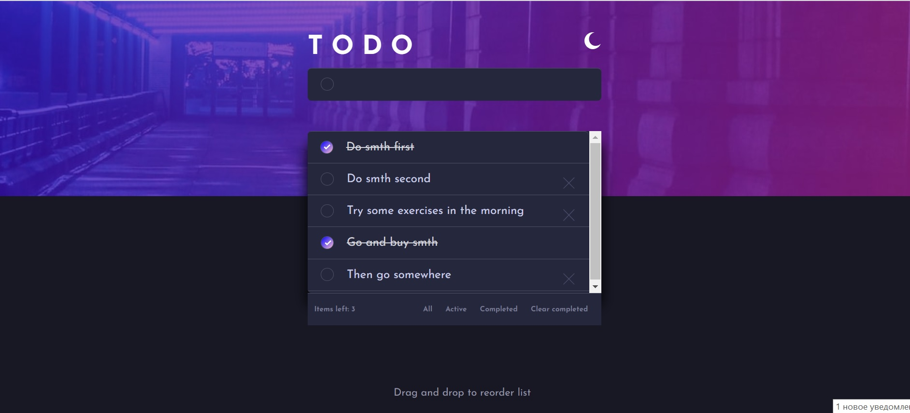
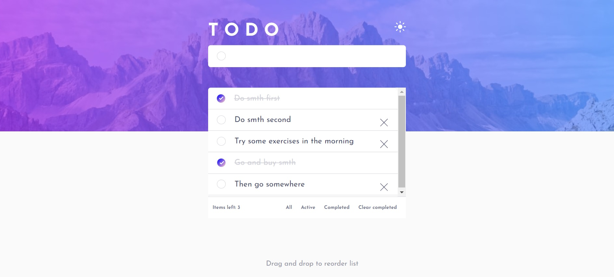
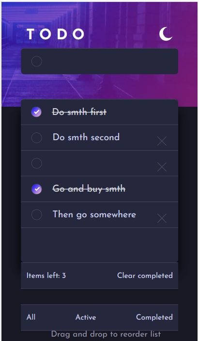

# ToDo_Application

# Frontend Mentor - TO DO solution

This is a solution to the [TO DO app challenge on Frontend Mentor](https://www.frontendmentor.io/challenges/todo-app-Su1_KokOW/hub). 

Probably it could be done in a more simple and straightforward way, but I decided to make it with Redux. 
I would appreciate your comments and suggestions, because I just learning. 

### Screenshots

### Links

- Solution URL: (https://stasmelamed.github.io/ToDo_Application/)
- Github repository with files - https://github.com/StasMelamed/ToDo_Application/tree/gh-pages

### Built with

- HTML,CSS
- TypeScript
- BootStrap
- React
- Redux

## Author

- Frontend Mentor - [@yourusername](https://www.frontendmentor.io/profile/StasMelamed)
